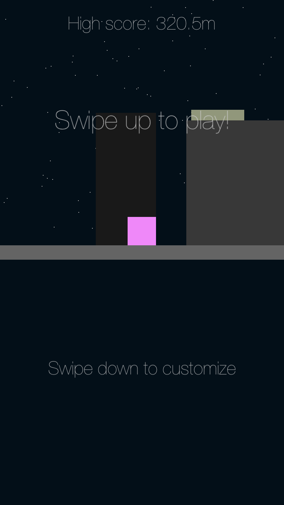
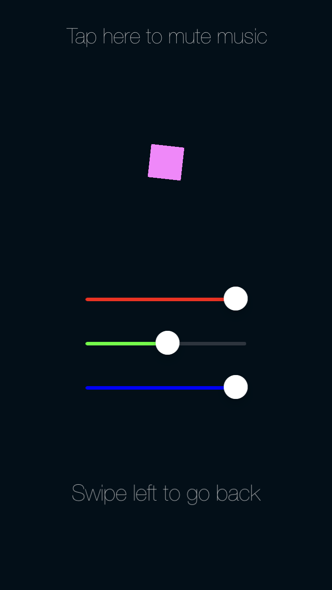
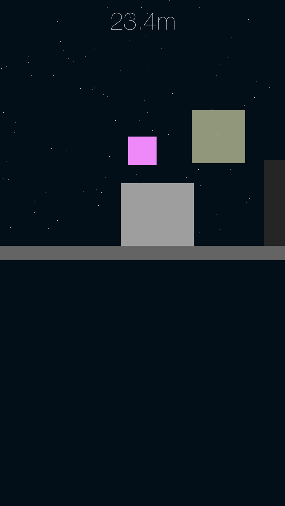
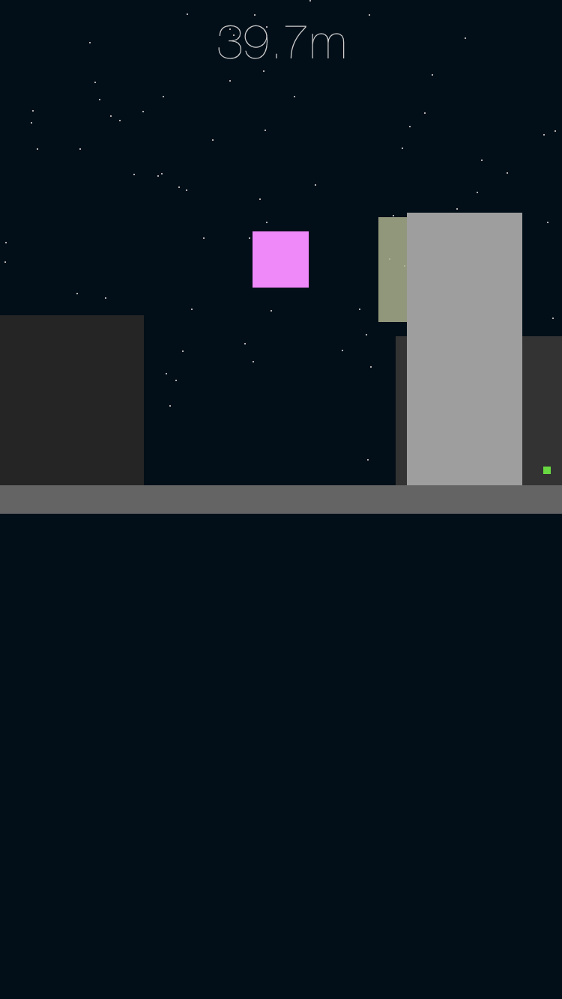
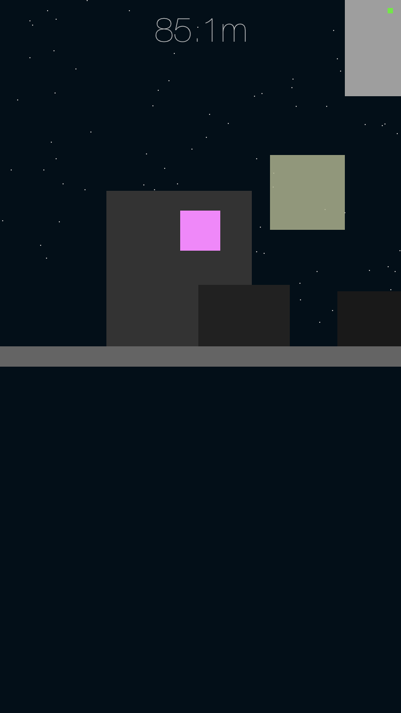
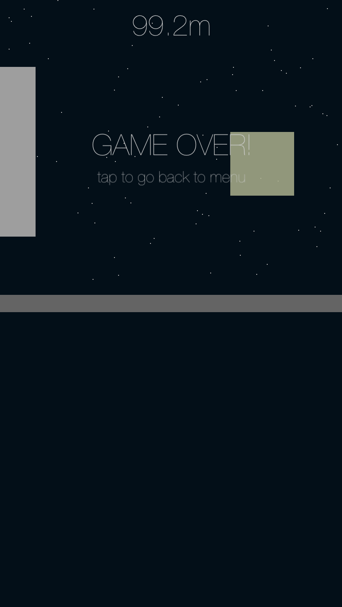

# BCube - Game

## General info
Native IOS game designed for iPhones.

## Technologies
This game is created with:
* Swift 5
* SpriteKit framework

## Screens from the game

  
Expand

  <h2>Start scene</h2>
  

    
  

  
  <h2>Customize scene</h2>
  

    
  

  
  <h2>Game scene</h2>
  

    
    
    
    
  

  
  <h2><a href="./Screens/gameplay.mp4">Gameplay video</a></h2>

